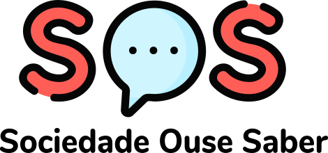

<h1 align="center">
  
</h1>
<p align="center">
  
  
  
  
</p>

<p align="center">
  
  
  
  <a href="https://github.com/gabrielmaialva33/sos/commits/master">
    
  
  </a>
</p>

<br>
<p align="center">
    <a href="README.md">English</a>
    ·
    <a href="README-pt.md">Portuguese</a>
</p>

<p align="center">
  <a href="#bookmark-about">About</a>&nbsp;&nbsp;&nbsp;|&nbsp;&nbsp;&nbsp;
  <a href="#computer-technologies">Technologies</a>&nbsp;&nbsp;&nbsp;|&nbsp;&nbsp;&nbsp;
  <a href="#wrench-tools">Tools</a>&nbsp;&nbsp;&nbsp;|&nbsp;&nbsp;&nbsp;
  <a href="#package-installation">Installation</a>&nbsp;&nbsp;&nbsp;|&nbsp;&nbsp;&nbsp;
  <a href="#memo-license">License</a>
</p>
</strong>
<br>

<p align="center">
    
</p>

## :bookmark: About

**SOS** is a platform to mediate professionals with people, stimulating motivation for the search for knowledge This project was implemented during the **project Management Work** by **[Gabriel Maia](https://github.com/gabrielmaialva33)**.

<br>

## :computer: Technologies

- **[Typescript](https://www.typescriptlang.org/)**
- **[Node.js](https://nodejs.org/)**
- **[Express](https://expressjs.com/)**
- **[TypeORM](https://typeorm.io/#/)**
- **[PostgreSQL](https://www.postgresql.org/)**
- **[ReactJS](https://reactjs.org/)**
- **[React Native](http://facebook.github.io/react-native/)**
- **[Expo](https://expo.io/)**
- **[Axios](https://github.com/axios/axios)**

<br>

## :wrench: Tools

- **[VisualStudio Code](https://code.visualstudio.com/)**
- **[Insomnia](https://insomnia.rest/)**
- **[Google Chrome](https://www.google.com/chrome/)**
- **[DataGrip](https://www.jetbrains.com/pt-br/datagrip/)**

<br>

## :package: Installation

### :heavy_check_mark: **Prerequisites**

The following software must be installed:

- **[Node.js](https://nodejs.org/en/)**
- **[Git](https://git-scm.com/)**
- **[NPM](https://www.npmjs.com/)** or **[Yarn](https://yarnpkg.com/)**
- **[Expo](https://expo.io/)**
- **[Expo App](https://play.google.com/store/apps/details?id=host.exp.exponent)**

<br>
  
### :arrow_down: **Cloning the repository**

```sh
  $ git clone https://github.com/gabrielmaialva33/sos.git
```

<br>

### :arrow_forward: **Running the applications**

- :package: API

```sh
  $ cd server
  # Dependencies install.
  $ yarn # or npm install
  # Data base creation.
  $ yarn typeorm migration:run # or npm run typeorm migration:run
  # API start
  $ yarn start # or npm start
```

- :computer: Web app

```sh
  $ cd web
  # Dependencies install.
  $ yarn # or npm install
  # Running web app
  $ yarn start # or npm start
```

- :iphone: Mobile app

```sh
  $ cd mobile
  # Dependencies install.
  $ yarn # or npm install
  # Running mobile app
  $ yarn start # or npm start
```

<br>

## :memo: License

This project is under the **MIT** license. [MIT](./LICENSE) ❤️

Liked? Leave a little star to help the project ⭐
